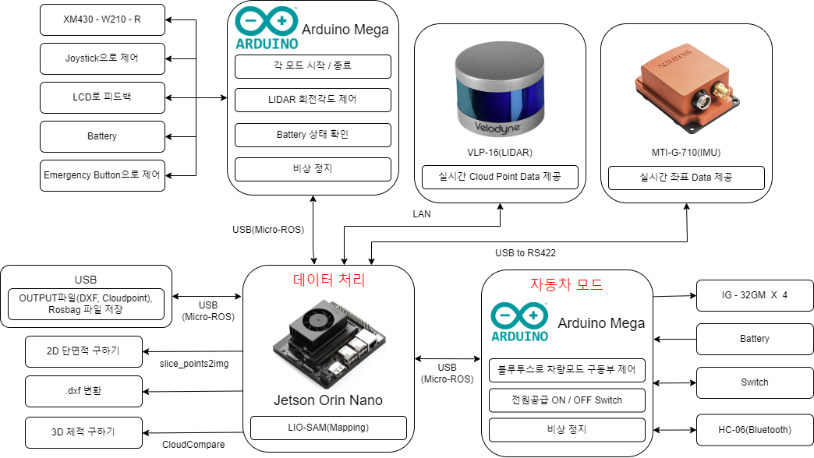

# 2024ESWContest_free_1110    MICCA

# 3D라이다를 활용한 지형 측량 디바이스

## 목차
1. [프로젝트 소개](#프로젝트-소개)
2. [개발환경](#개발환경)
3. [DIRECTORY TREE](#directory-tree)
4. [주요 함수별 기능](#주요-함수별-기능)
5. [Flow chart](#flow-chart)
6. [H/W](#hw)
7. [F/W](#fw)
8. [SW구성](#sw구성)
9. [기능설계도](#기능설계도)
10. [RESULT](#result)

----------


## 프로젝트 소개
- 이 디바이스는 3D라이다(LIDAR)와 관성측정장치(IMU)를 활용하여 지형 데이터를 수집하는 혁신적인 도구입니다. 이를 통해 정확하고 상세한 지형 정보를 제공합니다. 디바이스는 두 가지 측정 방식을 지원합니다.
    - 2D 단면 데이터 측정: 라이다 센서를 통해 특정 단면의 2차원 데이터를 수집하여 해당 구역의 상세한 정보를 제공합니다. 이는 특정 구역의 높낮이와 형태를 명확하게 파악하여 2D 도면으로 나타내어 줍니다.
    - 3D 데이터 측정: 라이다와 IMU를 결합하여 지형의 3차원 데이터를 생성합니다. 이를 통해 지형의 전체적인 구조와 특징을 입체적으로 파악할 수 있습니다. 필요시, 해당 공간의 체적을 구할 수 있습니다.
- 또한, 디바이스는 두 가지 모드로 측정을 수행할 수 있습니다.
    - 차량 모드: 디바이스를 4륜 차량에 장착하여 블루투스로 조작할 수 있습니다.
    - 셀카 모드: 좁은 내부 공간 등 차량이 들어가기 어려운 구역을 사람이 직접 손으로 들고 측정할 수 있습니다.
- 이 디바이스는 건설, 토목 공사, 상하수도 점검, 아파트(오피스텔) 내부 측량 등에 활용될 수 있습니다.

https://github.com/user-attachments/assets/1c61bd2a-fa79-40d2-b990-56d841b7673b

----------


## 개발환경
- OS: Window10, Ubuntu 20.04, ROS Noetic
- Tool: VScode, JupyterNotebook, Arduino
- 프로젝트 관리:Notion, Github
- 회로: OrCad Capture
- PCB: PADS Layout

----------

## DIRECTORY TREE
```
.
├─Atmel/
│  ├─car/
│  │      car.ino
│  └─control_box/
│         control_box.ino
├─catkin_ws/
│  └─src/
│      ├─LIO-SAM-master/
│      ├─velodyne/
│      └─xsens_ros_mti_driver/
├─circuit/
├─doc/
├─img/
├─modeling/
└─source/
    │  main_3.py
    ├─CloudPoint2CAD/
    │  │  CloudPoint2CAD.ipynb
    │  └─USB/
    │      └─LOAM_PCD/
    ├─CloudPoints_representative_value/
    │     CloudPoints_representative_value.md
    ├─log/
    ├─USB/
    ├─volume/
    └─    volume.py

```

각 폴더와 파일에 대한 개요입니다:

| 폴더, 파일 | 설명 |
| -------- | ----------- |
| `Atmel/` | Jetson Orin Nano와 통신, XM430-W210-T(모터), Control Box, 4륜 자동차, Atmega2560을 제어하기 위한 Atmel 소스 |
| `car.ino` | 4륜 자동차 제어를 위한 소스 |
| `control_box.ino` | Control Box를 이용해 Jetson Orin Nano와 Serial 통신을 위한 소스 |
| `catkin_ws/` | ROS Workspace|
| `src/` | ROS Workspace의 src 폴더 |
| `LIO-SAM-master/` | 3D Mapping을 위한 LIO SAM 알고리즘 |
| `velodyne/` | VLP-16(Lidar)을 사용하기 위한 소스 |
| `xsens_ros_mti_driver/` | XSENSE MTi-G-710-6A8G4(IMU)를 사용하기 위한 소스 |
| `circuit/` | F/W를 제어하기 위한 회로도 |
| `doc/` | 참고한 데이터셋, 자료 |
| `img/` | 프로젝트 수행 이미지 |
| `modeling/` | 모델링 이미지 |
| `source/` | 3D Mapping, 측정 데이터 처리를 위한 폴더 |
| `mian_3.py` | 3D Mapping, 측정 데이터 처리를 위한 소스 |
| `CloudPoint2CAD/` | Cloud Point를 CAD파일로 변환, 테스트 폴더 |
| `CloudPoint2CAD.ipynb` | 수집한 Cloud Point를 2D 단면으로 나타내 DXF 파일로 변환하는 소스 |
| `CloudPoints_representative_value/` | 3D Mapping 후 Cloud Points 전처리 자료 |
| `CloudPoints_representative_value.md` | 3D Mapping 후 CloudCompare를 활용한 Cloud Points의 대표 좌표값 추출 방법|
| `log/` | 'mian_3.py'의 log |
| `USB/` | 기록된 Ros Bag 파일, Cloud Point data, 데이터 처리 파일을 저장하기 위한 경로(삽입한 USB 경로) |
| `volume/` | 3D체적을 구하는 경로 |
| `volume.py` | Cloud Points의 대표 좌표값 추출 후 3D 체적을 구하는 소스 |

----------

## 주요 함수별 기능
### main_3.py

| 함수, 클래스 | 설명 |
| -------- | ----------- |
| `SERIAL` | 시리얼 포트를 통해 JetsonOrinNano와 Arduino간의 통신을 관리 |
| `socket_isOpen` | 지정된 호스트(Lidar VLP16)가 네트워크에서 활성 상태인지 확인하여, 연결 가능하면 True를 반환|
| `read_6D_PCDFile` | 맵핑 이후, PCD 파일을 읽어 XYZ 좌표, 강도(intensity), 회전(roll, pitch, yaw) 및 시간을 배열로 반환 |
| `slice_points2img` | 3D 포인트 클라우드를 주어진 평면의 법선 벡터에 투영하여 2D 평면에 XY 좌표로 변환한 배열을 반환 |
| `LIO_SAM` | LIO-SAM 프로세스를 관리하고 데이터를 처리, 여러 측정 모드들을 실행시키고 관리 |
| `change_lio_param` |  LIO-SAM의 설정 파일을 수정하여 PCD 파일 저장 위치를 업데이트 |
| `stop` | 현재 실행 중인 LIO-SAM 및 ROS BAG 프로세스를 중지 |
| `send_process_data` | 현재 프로세스의 진행 상태를 시리얼로 전송 |
| `cave_mode` | 동굴(CAVE) 측정 모드(모든 진행경로를 Mapping하는 모드)에서 데이터를 처리하고 ROS BAG 기록을 시작 |
| `processing` | 터널(TUNNEL) 측정 모드(측정 장비를 90도로 회전 후, 평면을 Scan하는 모드)에서 ROS BAG 기록을 시작 후 3D 좌표 데이터를 처리하여 2D로 나타냄 |
| `SERIAL_DATA_PROC` | 시리얼 데이터를 분석하여 상태를 업데이트하고, 들어오는 명령을 처리 |
| `SBC_CONTROL` | JetsonOrinNano, Arduino, LiDAR, IMU, Battery, USB 장치의 연결 상태를 모니터링하고, 필요에 따라 해당 장치와 상호작용 |
| `get_usb_stat` | 연결된 USB 장치의 정보를 반환 |
| `is_usb_device` | 주어진 장치가 USB 장치인지 확인하고, USB 장치일 경우 True를 반환 |
| `new_get_mount_points` | 현재 마운트된 USB 장치들의 정보를 반환 |\
| `arduino` | 아두이노 장치를 탐색하여 연결하고, 상태를 업데이트 |
| `lidar` | LiDAR 장치의 네트워크 연결 상태를 확인하고, 연결 여부에 따라 ROS 노드를 실행 또는 종료 |
| `imu` | IMU 장치의 USB 연결 상태를 확인하고, 연결 여부에 따라 ROS 노드를 실행 또는 종료 |
| `search_usb` |  USB 장치의 연결 상태를 확인하고, 아두이노에 USB 연결 상태를 알림 |
| `mount_usb` | 시스템에 연결된 USB 장치를 마운트 |
| `umount_usb` |  시스템에서 USB 장치를 언마운트하고 안전하게 연결을 해제 |
| `emergency_stop` | 비상 정지 명령이 내려졌을 때, 모든 프로세스를 종료하고 시스템을 셧다운 |
| `state` |  LiDAR, IMU, USB 장치가 모두 연결되어 있는지 상태를 반환 |

----------


## Flow chart

  
----------

## H/W
- Fusion 360을 통해 모델링
- 3D 프린터를 통해 제작

MODELING             |  REAL
:-------------------------:|:-------------------------:
  |  
  |  
  |  

----------


## F/W
- 블럭도
    

- Control Box
    - 회로도
        
        
    - PCB
        
- 차량 모드
    - 회로도
        
    - PCB
        

----------

## S/W구성


----------

## 기능설계도


----------

# RESULT

## Tunnel

Real             |
:-------------------------:|
 |

Scan             |  DXF
:-------------------------:|:-------------------------:
  |  

----------

## Cave

Real            |  Scan
:-------------------------:|:-------------------------:
<video src = "https://github.com/user-attachments/assets/7dc2f852-dbb4-49e8-8e83-06cb473ff6c9"> |  <video src = "https://github.com/user-attachments/assets/3b821411-f0cc-4dca-8465-04873961ad4c" width="20%" height="20%"> 

----------

## 건축물 2D 단면

Real             |
:-------------------------:|
 |

실제 설계 단면             |  Scan
:-------------------------:|:-------------------------:
  |  
실제 설계 넓이 : 119.136㎡	 |  Scan 넓이 : 119.09248㎡

오차율 : 0.037% 

----------

## 건축물 3D 체적

Real             |
:-------------------------:|
 |

실제 설계 단면             |  Scan
:-------------------------:|:-------------------------:
  |  
실제 설계 체적 : 313.32768m³	 |  Scan 체적 : 311.6963713501216m³

오차율 : 0.523%

----------

## Road

Real            |  Scan
:-------------------------:|:-------------------------:
<video src = "https://github.com/user-attachments/assets/0827d623-0713-4f08-83b8-101b94800f4f"> |   

----------
