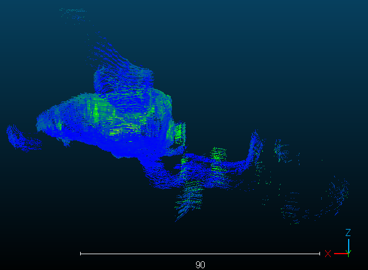

# CloudCompare를 활용한 대표 좌표값 추출 방법(전처리)

 **이민호**

[CloudCompare v2.6.1 - User manual.pdf](CloudPoints_representative_value/CloudCompare_v2.6.1_-_User_manual.pdf)

---

1. 파일 ➡️ 열기 ➡️ ‘cloudGlobal.pcd’ **파일 열기**

---

1. **좌표 축 정렬**
우측 하단 밑의 좌표계 참고 → 포인트들의 좌표 축이 정렬되어 있지 않음
    
    
    
    ➡️ 구름 아이콘 클릭 
    
    
    
    ➡️ 상단 메뉴 바에서 회전 클릭
    
    
    
    ➡️ 좌측 메뉴 바에서 도형을 클릭하면 내가 원하는 평면을 볼 수 있게 해줌.
    
    
    
    ➡️ 각각의 평면을 확인하고, 회전하고자 하는 축을 선택
    ➡️ 축 선택 후 회전 각도 입력( 많이 회전 → 큰 각도 / 정밀하게 → 작은 각도)
    
    윗칸 회전      :  축 회전
    아랫칸 회전  :  평면 이동
    
    ➡️ 백워드 or 전방을 눌러 회전시켜 회전 축을 정렬한다. 마우스로도 회전 가능
    
    ➡️ 정렬 완료 후 초록색 체크 클릭
    
    
    
    
    
    Boundary 박스와 함께 축이 잘 정렬 된 것을 알 수 있다.
    

---

1. **Region Of Interest - 원하는 단면 자르기**
    
    
    
    ➡️ 구름 아이콘 클릭 ➡️ 횡단면 클릭 ➡️ 원하는 크기로 잘라서 얻는다(좌측 메뉴바 - 평면 클릭 후 자르면 더욱 편함)
    
    
    
    화살표 끝 : 앞뒤로 자름
    
    동그라미 링 : 해당 축을 기점으로 회전시킴
    
    
    
    ➡️ 최종 범위 지정 후 해당 아이콘 클릭
    
    
    
    ➡️ 새로운 포인트들이 생김 ➡️ 이전 포인트 체크 해제
    
    
    

---

1. **쓰레기 좌표 값 필터링 (선택 사항)**
    
    
    
    
    

---

1. **대표 면 잘라내기**
➡️ 최종 section만 클릭
    
    
    
    ➡️ 최종 section만 클릭
    
    
    
    ➡️ 횡단면 클릭
    
    
    
    ➡️ X축을 기준으로 분할 ➡️ X축 슬라이싱 단면 두께 설정 (EX : 1m)
    
    
    
    ➡️ 오른쪽 아이콘 클릭
    
    
    
    ➡️ 슬라이싱 간격 갭 설정 (EX : 3m)
    
    
    
    
    
    ➡️ 좌표 초기화
    
    
    
    ➡️ Y축을 기준으로 분할 ➡️ Y축 슬라이싱 단면 두께 설정 (EX : 1m) ➡️ 반복
    
    
    
    
    
    ➡️ 해당 섹션 드래그 ➡️ 편집 ➡️ 병합 ➡️ 하나의 섹션으로 병합됨
    
    
    
    
    
    
    

---

1. **대표 점 추출 (Down Sampling)**

➡️ 하위샘플 포인트클라우드 클릭
    

    
➡️ 방식 : Spatial ➡️ 점간 최소공간 설정 (EX :  3m) ➡️ 확인
    

    
➡️ 점 크기 조절 (가시성 설정) ➡️ 이상유무 확인
    

    

    
➡️ shift + 포인트 (마우스 왼쪽)클릭 ➡️ 좌표 값 나옴
    

    

---

1. **엑셀 내보내기**

➡️ 최종 섹션 클릭 ➡️ 파일 ➡️ 저장  
    

    
➡️ 파일 형식 : ASCII cloud ➡️ 파일 이름 :  (이름).csv ➡️ 저장
    

    
➡️ 엑셀 기준 분리자 : comma ➡️ 컬럼 제목 클릭
    

    
➡️ 엑셀 파일 확인 ( 차례대로 X좌표, Y좌표, Z좌표, 포인트 강도)
    

